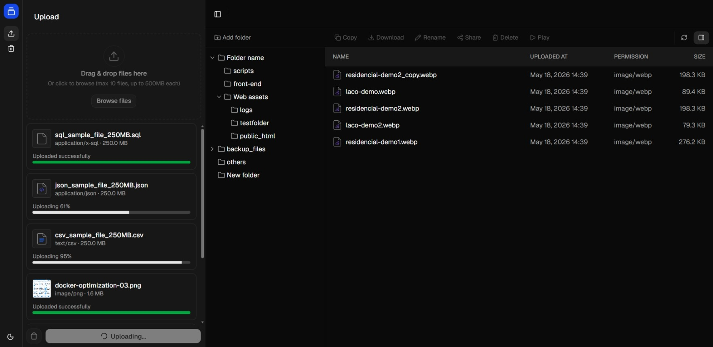

# Filebox 📦

Complete upload & download flow with AWS S3 pre-signed URLs and large file processing with aws lambda and dynamodb.

## features:
- [x] File upload to S3 with presigned URLs
- [ ] Large file processing with multipart upload
- [x] File download from S3 with presigned URLs
- [x] Checksum validation for file integrity
- [x] Dynamodb for file metadata storage sync
- [x] Delete & restore files flow with S3 delete-markers & lifecycle policies
- [ ] Copy files on S3 & update metadata in DynamoDB
- [ ] File sharing via expiring pre-signed URLs with URL shortening
- [ ] Video streaming support
- [ ] Folder support with prefix-based operations
- [ ] Imagine processing with AWS SQS and Lambda

## Project stack & layout
This project is a monorepo managed with pnpm workspaces, containing the backend API and the frontend web app, along with shared types and utilities in a separate package.
```
apps/
  api/        Serverless Framework backend (Lambda + S3 + DynamoDB)
  web/        Vite + React with Shadcn frontend
packages/
  shared/     Shared types and HTTP contracts
```

## Getting started

### Prerequisites

- Node.js 20+
- [pnpm](https://pnpm.io/installation)
- An AWS account with credentials configured (`aws configure`)
- An existing S3 bucket

### 1. Install dependencies

```bash
pnpm install
```

### 2. Configure environment variables

**`apps/api/.env`** — copy from the example and set your bucket name:

```bash
cp apps/api/.env.example apps/api/.env
```

```env
BUCKET_NAME=your-s3-bucket-name
```

**`apps/web/.env`** — point the web app at your API:

```env
VITE_SERVER_URL=http://localhost:3000
```

### 3. Run in development

From the repo root, start both apps in parallel:

```bash
pnpm dev
```

Or run each one separately:

```bash
# API (serverless-offline on http://localhost:3000)
pnpm --filter api dev

# Web (Vite on http://localhost:5173)
pnpm --filter web dev
```

### 4. Deploy the API

Inside `apps/api`:

```bash
pnpm exec serverless deploy
```

After deployment, update `VITE_SERVER_URL` in `apps/web/.env` with the API Gateway URL printed by Serverless, then build the web app:

```bash
pnpm --filter web build
```

## Scripts

Run from the repo root — they fan out to every workspace:

| Command | Description |
| --- | --- |
| `pnpm dev` | Run all apps in dev mode |
| `pnpm build` | Build all apps |
| `pnpm lint` | Lint all packages |
| `pnpm typecheck` | TypeScript check all packages |
| `pnpm format` | Format with Prettier |
